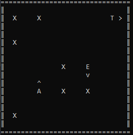

# Grid Agent

A project solving a simple reinforcement learning problem with the [Policy Iteration](https://en.wikiversity.org/wiki/Reinforcement_Learning/Policy_iteration) algorithm.  
On a grid there is a target, an opponent and an agent, the objective of the agent is to get to the target without being caught by the opponent.

## How to install

**NOTE**  
This project was tested using Python 1.13 so it may not be compatible with older versions.

1. Clone the project.
   ```sh
   git clone https://github.com/Lnrz/MASProject.git
   ```

2. Move the shell to the root folder of the project.

3. Install the requirements.
   ```sh
   pip install -r requirements.txt
   ```
   This step is necessary only if you want to view the learning statistics since it's the only part of the project using matplotlib.

## How to run

1. Move the shell to the src folder.

2. - If you want to run a game session:
   ```sh
   python game.py <path_to_configuration_file>
   ```
   - If you want to run a learning session:
   ```sh
   python train.py <path_to_configuration_file>
   ```
   - If you want to run a learning session and view the learning statistics:
   ```sh
   python train_and_view.py <path_to_configuration_file>
   ```
   - If you want to view saved learning statistics:
   ```sh
   python view_traindata.py <path_to_the_saved_statistics>
   ```
   You can use the -h flag to view the options of every script.

## Examples

### Game Session Example

After having moved the shell into the src folder:
```sh
python game.py ..\configs\example.cfg
```



### Train Session Example

After having moved the shell into the src folder:
```sh
python train_and_view.py -d ..\configs\example.cfg
```


## How to customize

### How to make a custom configuration file

Refer to the provided [example](configs/example.cfg) and [info](configs/info.txt) files.

### How to make a custom game or train viewer

Both GameManager and TrainManager accept a callback which they will call after every iteration passing relevant data about the current iteration: [GameData](src/grid_agent/entities/game_manager.py) for GameManager, [TrainData](src/grid_agent/entities/train_manager.py) for TrainManager.

A simple example:
```python
def my_callback(gamedata: GameData) -> None:
    ...

manager.register_callback(my_callback)
manager.start()
```

For more complex examples refer to [game.py](src/game.py) and [ASCIIView](src/grid_agent/views/ascii_view.py) or [train_and_view.py](src/train_and_view.py) and [TrainView](src/grid_agent/views/train_view.py).

### How to extend the configuration file parser

Both GameConfigs and TrainConfigs provide a [line_processing_extension](src/grid_agent/configs/base_configs.py) member that you can use to implement custom behaviour when parsing a configuration file so to give semantic to lines not recognized by the default configurations objects.

A simple example:
```python
def my_line_processing_extension(configs: BaseConfigs, line: list[str]) -> None:
    ...

configs.line_processing_extension = my_line_processing_extension
manager = Manager(configs)
manager.start()
```

For a more complex example refer to [extension_example.py](src/extension_example.py).